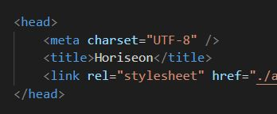
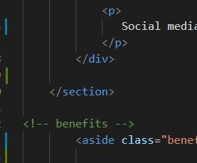

# MSU Bootcamp Challenge 1: Horiseon

**This is a README for the refaction of a Horiseon's website.  The aim of the refaction was to ensure that Horiseon had a "codebase that followed accessibility standards" so their website is "optimized for search engines."  I utilized my developing skill set in HTML and CSS to make the folling changes to the original code:**

* A broken link in the header was repaired to allow for quick navigation
* ALT tags were added to each image to help with the accessibility and screen readers
* HTML and CSS Styles condensed where appropriate for the content and benefits to help reduce the amount of code present
* Comments were added to both the HTML and CSS files for organization purposes
* A descriptive title was added (shown below), to identify the website in the tab:

* Semantic HTML tags were added where appropriate, including the following: header, nav, section, aside and footer (some examples shown below) to help organize the code:

## Deployed Application
[Horiseon](https://erin-michon.github.io/Challenge1/)
